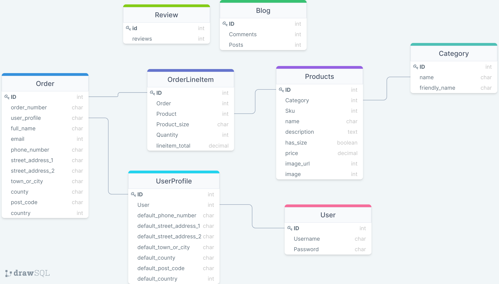

### **Accessing admin**

- To access the admin the super user is 
  - username - ms4-admin
  - password - admin123456789

### **Make a dummy purchase** 

- To make a dummy purchase, you can use a dummy card number which is:
   - 4242 4242 4242 4242 0424 2424

[View live project here](https://hanks-dog-parlour.herokuapp.com/)

## **Content**

- [**UX (User Experience)**](#ux-user-experience)
  - [**Target Audience**](#target-audience)
  - [**Project Goals**](#project-goals)
  - [**User Goals**](#user-goals)
  - [**Site Owner Goals**](#site-owner-goals)
  
- [**Design Choices**](#design-choices)
  - [**Fonts**](#fonts)
  - [**Colours**](#colours)
  - [**Imagery**](#imagery)
  - [**Logo**](#logo)
  - [**Wireframes**](#wireframes)
  - [**Site Map**](#site-map)
  - [**Database**](#database)

- [**Features**](#features)
  
- [**Testing**](#testing)

- [**Technologies**](#technologies)
  - [**Languages**](#languages)
  - [**Libraries**](#libraries)
  - [**Tools**](#tools)

- [**Deployment**](#deployment)

- [**Credits**](#credits)
  - [**Code**](#code)
  - [**Content**](#content)
  - [**Images**](#images)
  - [**Videos**](#videos)
  - [**Inspiration**](#inspiration)
  - [**Acknowledgements**](#acknowledgements)
  
  ## **UX (User Experience)**

  [Back to contents](#content)

### **Target Audience**
- Dog lovers
- All ages

[Back to contents](#content)

### **Project Goals**
The primary goal of this project is to create a website that works perfectly, is visually appealing in design, and is easy to navigate for a first-time user. It allows users to perform not only the basic functionalities in a website (for example sign up/login, ability to purchase items, and perform payments), but also to ensure that users have a great experience and more interactivity within the site through additional functionalities such as putting items into their basket and purchasing these items.

### **User Goals**
The user will be looking for:
- A website that is straightforward and intuitive to use, easy to navigate and also makes a purchase.
- A website where there is a variety of products that can also be searched individually by the user.

### **Site Owner Goals**
As a site owner, I would like to provide a clear, easy to navigate, an eye-catching site that users will enjoy visiting and find everything they are looking for. I want to give access to a shop for users to buy items. I would also want the user to gain access to a basket feature which will allow the user to come back to their basket and have the items they have selected ready for when they want to pay. By achieving this, the user will be able to delete and update their basket with no trouble.

[Back to contents](#content)

### **User Stories**
As a shopper I want to be able to:

- As a customer, I would like to easily navigate through the website.
- As a customer, I would like to easily identify what products are available.
- As a customer, I would like to see a description of the product.
- As a customer, I would like to search for a specific product by a keyword.
- As a customer, I would like to add products to my shopping bag.
- As a customer, I would like to be notified when adding an item to my shopping bag.
- As a customer, I would like to edit or delete an item from my shopping bag.
- As a customer, I would like to see my previous orders.

[Back to contents](#content)

## **Design Choices**

### **Fonts**


When choosing a font I came across many really good fonts to choose from on google font and also dafont just to see if they had anything that google font did not. After a meeting with the client and vigorous testing, I decided to go with Oswald as this was the most eye-catching and was very similar to the original logo that the client had sent me. I also went with san-serif as the backup font just in case my chosen font failed.

### **Colours**


The website I used to get my pallet was coolors.com where I uploaded the logo that the client gave me and this generated a pallet. I chose these colours to have a choice just in case one colour collided with another. I only use three colours from this pallet which were #000000, #ffffff and #D1A702. 

### **Imagery**

I will create an image for the main home page banner which will feature a random dog parlour. I had to import this image into photoshop to alter a few things so that the image was suitable for my website.

The imagery came straight from the client herself so I never had to search for any images. This made the process of making the website quicker as I never had to look around for any images to use. The images are located in my static folder. The only image I grabbed from Google was a no image sign which was used just in case the user admin did not want an image on there or accidentally added a product but forgot the image.

[Back to contents](#content)

### **Logo**

[Back to contents](#content)

### **Wireframes**

Initial Wireframes were produced showing the Products, home page, order summary, Basket and mobile nav layouts.

#### **Web**


[Back to contents](#content)

### **Site Map**


A Site Map was produced for the first development stage and is shown above. Note that the orange squares are the pages that only the admin can access so that no one can delete or edit a product.

### **Database**



1. Home
- Contact
   - This model contains information relating to messages sent by users to the store.

2. Home
- Contact
   - This model contains information relating to messages sent by users to the store.

3. Checkout
- Order
   - This model contains information relating to messages sent by users to the store.
- OrderLineItem
   - This model contains information on the products in the customer's order, quantity and total with or without a delivery charge.

4. Products
- Product
   - This model contains information relating to all the products for sale on the site.

- Categories
   - This model contains information about the various categories of products on the site.

4. Profile
- UserProfile
   - This model contains the default order details saved from customer's previous orders which they can use for future orders.

5. Blog
- Post
  - Contains the blog post and details of its author and title.
- Comments
  - Contains the comments for each post.

6. Reviews
- Review
  - Contains the review sections.

[Back to contents](#content)

## **Features**

### **Landing Page**

1. Navbar
- The navbar contains the main links and navigation throughout the site. it remains consistent at the top of each page.
- The navbar is fully mobile responsive and reacts to changes in screen size. It also allows for the collapsible menu on mobile screens.
- The navbar also contains all the categories of products on the site through the various dropdowns.
- The search bar disappears on mobile view but still works when the search icon is clicked, my account and bag also work on mobile view.

2. Delivery Message
- The delivery banner provides a clear and concise message to the user about needing to spend 50 pounds to get free delivery.
- The delivery information banner appears just below the navbar on each page, it is fully mobile responsive and reacts to the changes in screen size.

3. Home Page
- Navigation bar at the top of the page provides for easy and intuitive navigation throughout the site.
- Distinct image and highlighted section letting the user know exactly what the site is about.
- Search bar at the top of the page provides a way for a user to search the site for a specific item that they are looking for.
- Background image used of a workshop to make it easier to read the text and see the buttons.
- Big shop button on top of the image to direct users straight to the store if needed.

4. Product Page
- The navigation bar at the top of the page displays all the categories of products on the site for ease of use for the user.
- A user can sort the products throughout the site based on name and price by choosing from the select dropdown at the top of the page.
- When a user searches from the search bar at the top of the page the results are shown on this products page again in paginated format.
- A add or delete function at the bottom of each product for the admin to create, update or delete products.
- Once a product is selected a details page will show stating how many items you would like to purchase and if necessary a dropdown size selector.
- Two big buttons on the bottom of the details page to keep shopping, or to add the item to your basket.

5. Add products
- This page is only available to superusers and can be found by clicking on my account at the top of the page and then selecting product management.
- This page contains a form which a superuser can use to add products to the database and have the products appear on the site when done and the form is submitted the user gets taken to the products page of the product they have added and a message appears showing them they have successfully added the product to the database.
- Once the admin has added a product, A message will appear in the top right-hand corner stating that the product was successfully added.

6. Edit Products
- This page is only available to superusers and can be found by clicking on my edit link on either the products page or the product details page.
- The edit product page will be a form which is instantiated with the details of the product that a user is editing.
- Once the admin has edited a product, A message will appear in the top right-hand corner stating that the product was successfully edited.

7. Bag
- In the navbar at the top of the bag on all screen sizes a bag icon will appear, this bag will be turquoise and display £0.00 by default. Once a user adds an item to the bag the bag icon will change to a gold colour to signify an item in the bag. When a user clicks on the bag icon they will be taken to the bag page.
- When a user clicks on the bag icon when they have no items in the bag the below will be displayed indicating they have no items in their bag and a keep shopping button to encourage them to add items to their bag.
- When a user clicks on the bag icon when they have items in the bag the below will be displayed the items in their bag and a secure checkout button to encourage customers to move forward to the checkout process and a keep shopping button which encourages them to add more items to their bag.

8. Checkout
- When the user has items in their bag, a secure checkout button will appear, when they click on this secure checkout button on the bag page, they will get taken to the checkout page where they can complete their order and pay for their order via stripe.
- Display an order summary of what's in the shopping bag.

9. Profile Page
- Has profile navigation allowing users to view their information.
- A section with the order they have previously made.

10. Blog Page
- All the infomation will be located here for latest updates of the company.
- Only the admin can add/delete blogs.

11. Review Page
- Users will be able to access this to leave a personal review.
- The user can also delete and update the review, but only their own.

[Back to contents](#content)

## **Testing**

- #### Testing.
  - The testing section for this site is located at the following link.
    - [Testing file](readme/testing/testing.md)

## **Technologies**

### **Languages**

  - [HTML5](https://en.wikipedia.org/wiki/HTML5). 
    - Used for the main markup language for my game content.
  - [CSS3](https://en.wikipedia.org/wiki/CSS). 
    - Used to style my pages and the content on the game.
  - [JS](https://en.wikipedia.org/wiki/JavaScript). 
    - Used to contact the DOM.
  - [Python3](https://en.wikipedia.org/wiki/Python_(programming_language))

### **Database**
- Development - SQLite
- Deployed site - Heroku PostgreSQL

### **Storage**
- Amazon AWS S3 - is used to store static files.

### **Payment**
- Stripe - fully integrated payments platform.

### **Framework**
- Django - web development framework.
- jQuery - to assist with JavaScript coding and DOM manipulation.
- Bootstrap - to assist with responsive design.

### **Libraries**

- coolers.co Color scheme generator.
- Google Fonts Font library.
- Font Awesome Icons.
- jQuery JavaScript Library.
- Heroku Cloud platform.
- Website Mockup Generator is used to generate responsive screenshots.
- Responsinator.com.
- Imgur.
- psycopg2 - PostgreSQL database adapter for Python. Used as part of the Heroku deployment process.
- flake8-Django - Flake8 plug-in for Django, for python code validation.
- pillow - Python imaging library.
- gunicorn - Python WSGI HTTP Server for UNIX. Used as part of the Heroku deployment process.
- Django-countries - Django application provides country choices for use with forms etc. Used to populate country choprovideshe Country dropdowns.
- DJ-database-URL - Django database configuration utility. Used to configure the connection to the Heroku deployed Postgres database.
- Django-crispy-forms - enables enhanced rendering of Django forms including integration with Bootstrap.
- Django-all auth - user authentication and account management.
- DB diagram - used to plan and visualise the data schema before and during development.
- MindMup - is used to produce the Site Map.
- DrawSql - schema database diagram

### **Browser**

- Google Chrome

### **Tools**

- [Git:](https://git-scm.com/)
    - Git was used for version control by utilizing the Gitpod terminal to commit to Git and Push to GitHub.
  - [GitHub:](https://github.com/) 
    - GitHub is used to store the project's code after being pushed from Git.
  - Photoshop - Used to edit all my images in my project.

[Back to contents](#content)

## **Deployment**

Once the app was setup and ready to go I deployed it to Heroku by following the steps below:

* I created an app on the Heroku website which I called ms4-fit-as-a-fiddle

    * I clicked on the new button.
    * I then clicked on the create a new app link.
    * I then gave my app the name of ms4-fit-as-a-fiddle and chose Europe as my closest region.
    * Finally, I selected to create my app.

* Next, I set up the Postgres database.

    * in Heroku,
        * Go to the app resources section, search for Postgres
        * then I chose to add to the project and chose the free plan for my project.
        * To use Postgres, I had to install two dependencies in gitpod, dj_database_url and psycopg2
    
    * in Gitpod
        * I installed both dj_database_url and psycopg2 using the command:
            * `pip install`
        * then, using the command: pip3 freeze > requirements.txt, I added the dependencies to the requirements file which is needed by Heroku.
        * Then in settings.py I imported dj_database_url:
            * `import dj_database_url`
        * then, I commented out the current database settings and replaced them with the settings of the Postgres database:
        ```
        DATABASES = {
            'default': dj_database_url.parse('DATABASE_URL')
        }
Heroku  ```
        * DATABASE_URL above is an environmental variable and as such should not be shown in version control. The database URL can be found in your app config settings in Heroku.
        * Once the above method is set up, models need to be migrated to the new database using the command below:
            * `python3 manage.py migrate`
        * I then created a new superuser for my site on Heroku using the command below:
            * `python3 manage.py create superuser
        * When that was done I then committed my changes and made sure not to include environment variables in the version control.
        * Then, I created an if-else statement in the settings.py to use Postgres if the DATABASE_URL variable is available and otherwise use the default database in gitpod.
        ```
        if "DATABASE_URL" in os.environ:
                DATABASES = {
                    "default": dj_database_url.parse(os.environ.get('DATABASE_URL'))
                }
          else:
                DATABASES = {
                    'default': {
                        'ENGINE': 'django.db.backends.sqlite3',
                        'NAME': BASE_DIR / 'db.sqlite3',
                    }
                }
        ```
        * The Postgres database should now be ready for use.

    * Gunicorn
        * For the app to work on Heroku we need a way for Heroku to tell that the app is a web application, which is where Gunicorn comes in.
        * Installing Gunicorn
            * `pip3 install Gunicorn`
        * A Procfile then needs to be created to tell Heroku how to run our app. this is achieved below:
            * `touch Profile
        * In the Procfile we need to tell it to use a web server, this is achieved by placing the below code in the profile:
            * `web: gunicorn <appname>.wsgi:application`
    
    * We now need to connect to Heroku in the terminal on gitpod
        * use the following command
            * `Heroku login -i`
        * log in using the email and password that you used to create an account on the Heroku website.
        * then, I disabled the collection of static files temporarily until AWS has been set up.
            * `heroku config:set DISABLE_COLLECTSTATIC=1 --app <appname>`
            * the --app command is used when you have more than one app in your Heroku account
        * Now, in settings I added Heroku into my list of allowed hosts, and localhost so the project can still b run locally using the following settings.
            * `ALLOWED_HOSTS = ["<heroku appname>.herokuapp.com", "localhost"]`
        * changes were then pushed to Github
        * Then I needed to set up pushing to Heroku achieved below
            * `heroku git:remote -a <heroku appname>`
        * then the project gets pushed to GitHub using:
            * `git push Heroku master
        * Heroku now builds the app.
    
    * On the Heroku Website
        * Go to the deploy section of the app.
        * I searched for the app being used on Github
        * When it was found I connected and then clicked on enable Automatic deploys
        * Now any changes pushed to Github will automatically be pushed to Heroku too.
    
    * Amazon AWS
        * Amazon AWS was used to store both static and media files of my project
        * I created an AWS account and worked through the process of signing in. Once my account was set up I was able to set my project up on aws.
        * First, I needed to create a bucket.
            * search for aws s3 service.
            * click on the Create Bucket button.
            * Give the bucket a unique name and then select the region.
            * uncheck the block public access and acknowledge that the bucket will now be public.
            * click create a bucket.
        * Bucket settings
            * Properties
                * Go to the bucket Properties section
                * Turn on static website hosting
                * in the index and error text inputs, add index.html and error.html.
                * then, click Save.
        * Permissions
            * Go to the bucket Permissions section.
            * In the cors config paste in the below code:
                * ```
                    [
                        {
                            "AllowedHeaders": [
                                "Authorization"
                            ],
                            "AllowedMethods": [
                                "GET"
                            ],
                            "AllowedOrigins": [
                                "*"
                            ],
                            "ExposedHeaders": [

                            ]
                        }
                    ]
                  ```
            * In the bucket policy, click on the generate policy
        * Policy
            * Select S3 bucket policy
            * Add * to the principal field to select all principals
            * select action to get the object
            * Paste in your ARN which can be found on the bucket policy page.
            * click add a statement
            * then, click on the generate policy button
            * then, copy and paste the new policy into your bucket policy
            * also, add /* onto the end of the resources key
            * and, click Save.
        * Access Control List
            * Go to the Access Control List section.
            * set list-objects permission to everyone.
    
    * Create a new user

        * On the admin page for aws search for IAM to add a new user
        * Create a group
            * We need to create a group to put our users in
            * Click create a new group and name it.
            * click through to the end and save the group.
            * Create a group policy
                * click policy and the click create policy
                * select the JSON tab and then import managed policies.
                * search s3 and select on Amazons3fullaccess and import.
                * in the resources section, paste in the ARN that was used above.
                * click through to review the policy.
                * fill in the name and description and then click generate policy.
            * back into the group, click on permission and attach the policy.
            * find the policy you have just created and attach it.

        * Create the user
            * select users from the sidebar and then click on add user
            * create a username and then select programmatic access then click on next.
            * Select the group to add your user too
            * click through to the end and then click create a user.
            * Download the CSV file containing the user keys needed to access the app
    
    * Connect bucket to Django
        * First install two packages in the IDE, boto 3 and Django storages, seen below:
            * ```
                pip3 install boto3
                pip3 install django-storages
              ```
        * Now we need to add this to our requirements.
            * `pip3 freeze > requirements.txt`
        * storages then needs to be added to installed apps in settings.py
        * an environment variable called USE_AWS needs to be set up to run the code on Heroku.
        * The settings needed for the project in the settings.py file are below:
            * ```
                if "USE_AWS" in os.environ:
                    # Bucket configurations
                    AWS_STORAGE_BUCKET_NAME = "<bucket name>"
                    AWS_S3_REGION_NAME = "<bucket region>"
                    AWS_ACCESS_KEY_ID = os.environ.get("AWS_ACCESS_KEY_ID") # taken from downloaded csv file
                    AWS_SECRET_ACCESS_KEY = os.environ.get("AWS_SECRET_ACCESS_KEY") # taken from downloaded csv file
                    AWS_S3_CUSTOM_DOMAIN = f'{AWS_STORAGE_BUCKET_NAME}.s3.amazonaws.com'

                    # static and media files
                    STATICFILES_STORAGE = "custom_storages.StaticStorage"
                    STATICFILES_LOCATION = "static"
                    DEFAULT_FILE_STORAGE = "custom_storages.MediaStorage"
                    MEDIAFILES_LOCATION = "media"

                    # now need to override static and media Urls for production
                    STATIC_URL = f'https://{AWS_S3_CUSTOM_DOMAIN}/{STATICFILES_LOCATION}/'
                    MEDIA_URL = f'https://{AWS_S3_CUSTOM_DOMAIN}/{MEDIAFILES_LOCATION}/'
              ```
Heroku  * Back in Heroku click on the settings tab and then click reveal config vars.
        * Then set up the enenvironmental variables as required.
        * Back in the IDE, we need to create a custom storages.py to tell Django that in production we want to use Amazon S3 to store our static and media files
        * import S3Boto3Storage at the top of the custom_storages.py file.
        * Set up classes to tell Django where to store the files as shown below:
            * ```
                class StaticStorage(S3Boto3Storage):
                    location = settings.STATICFILES_LOCATION
                
                class MediaStorage(S3Boto3Storage):
                    location = settings.MEDIAFILES_LOCATION
              ```
        * push all the changes to Github from the IDE
    
    * Add Media files to AWS
        * in your AWS bucket, create a new folder called media
        * select upload and then upload all your image files
        * select to grant public access
        * finally, click to upload your files.
    
    * Setting the project up locally

        * Find your GitHub repo, on the code dropdown.
        * then choose to extract files to your repository.
        * open the IDE of your choice and open the folder containing the code using your IDE.
        * Once this is done, you can now download the requirements needed to run the project using the below command in your IDE terminal:
            * ` pip3 install -r requirements.txt `
        * You can also choose to clone your files from GitHub to your repository in the IDE by again, choosing the code dropdown in tour GitHub repo and copying the HTTPS URL that is provided in the dropdown.
        * then when the URL has been copied return to your terminal and use the code below:
            * ` git clone https://github.com/Brianconn71/fit-as-a-fiddle.git`
        * once this is done, you then need to set up the below environment variables to use the full functionality of the site:
            * DJANGO_SECRET_KEY = your secret key
            * STRIPE_PUBLIC_KEY = your stripe public key
            * STRIPE_SECRET_KEY = your stripe secret key
            * STRIPE_WH_SECRET = your stripe webhook secret
            * IN_DEVELOPMENT = True
            * Your stripe variables which can be found on your stripe dashboard
            * You need a Django secret key which can be found [here](https://miniwebtool.com/django-secret-key-generator/)
        * Then you need to migrate the database models to set up your database.
            * First check for migrations:
                `python3 manage.py makemigrations --dry-run`
            * then make migrations:
                * `python3 manage.py make migrations
            * check to see how migrations will work out:
                * `python3 manage.py migrate --plan `
            * Lastly, if all looks good, migrate:
                * `python3 manage.py migrate`
        * Now, a superuser account needs to be created to access the admin section, so follow the step below to create a superuser
            * ` python3 manage.py createsuperuser `
        * enter your username and password
        * finally, we need to run the project to ensure the working order and we are good to go.
            * ` python3 manage.py runserver`

[Back to contents](#content)

## **Credits**

### **Content**
  - https://github.com/LukeSmallman/pure-fitness.git
  - https://codepen.io/trending 
  - https://learn.codeinstitute.net/courses/course-v1:CodeInstitute+DCP101+2017_T3/courseware/9e2f12f5584e48acb3c29e9b0d7cc4fe/579bbf01edaf47938e6a860b8f08f275/
  - Slack

### **Images**
- Beth Moyle - Hanks Dog Parlour

 ### **Acknowledgements**
   - My mentor was a really big help in sorting out bits of code that I kept missing.
   - Student support at code institute for their information and support.

[Back to contents](#content)